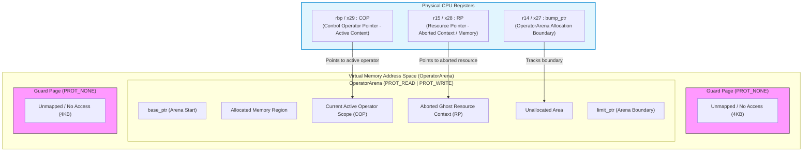
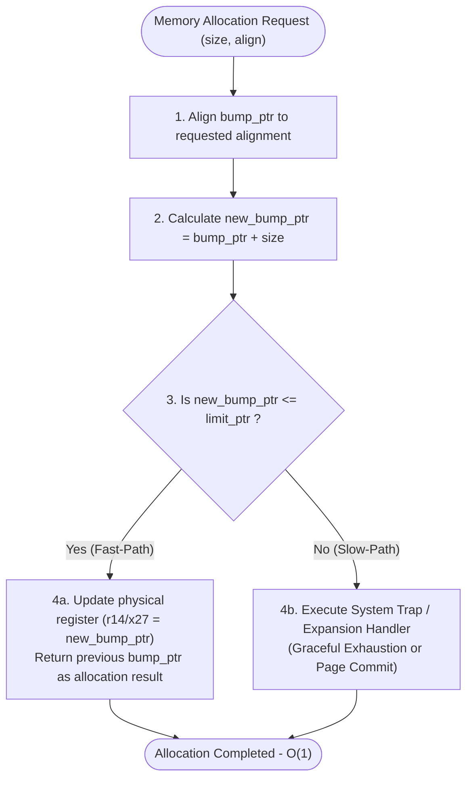
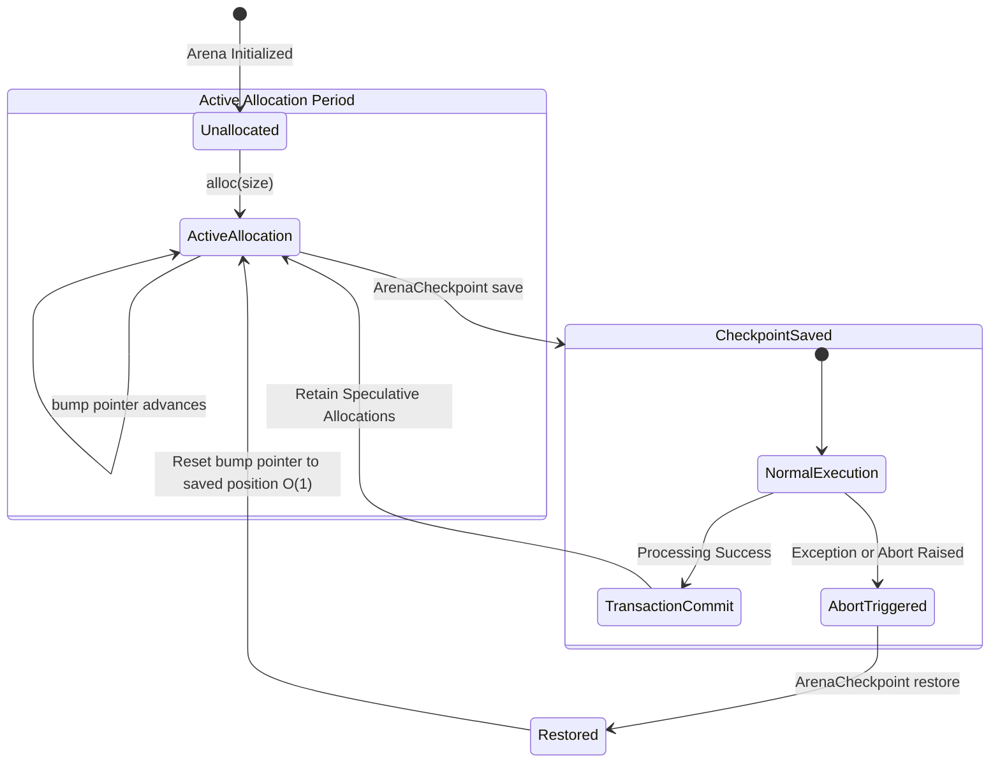
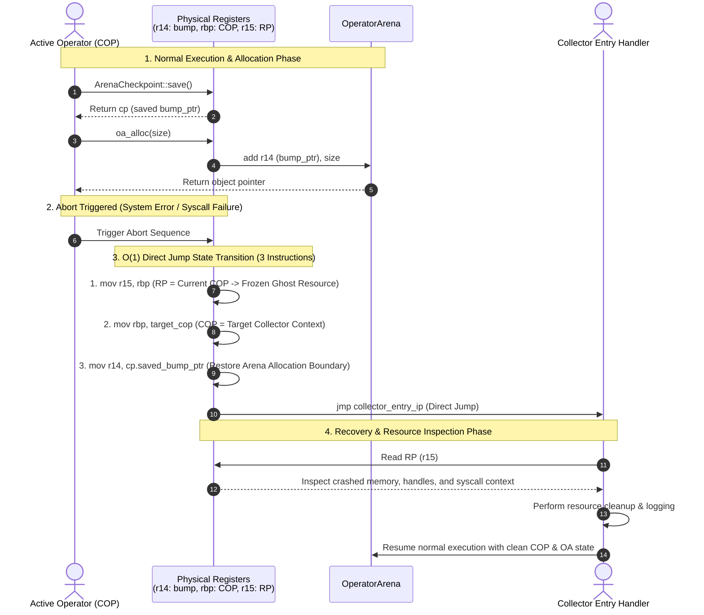

# Detailed ABI Layer Functional Specification: OperatorArena, ArenaCheckpoint, OperatorPointer & ResourcePointer

This specification defines in detail the system structures, low-level behaviors, physical register bindings, and interaction protocols of `OperatorArena`, `ArenaCheckpoint`, `OperatorPtr` (COP), and `ResourcePtr` (RP), which form the core of the **ABI (Application Binary Interface) layer** in Seam VM.

---

## 1. System Architecture & Register Map

### 1.1 Physical Register Mapping

In this ABI, control pointers and allocation boundaries are permanently bound and resident in physical CPU registers to minimize runtime overhead and achieve stack-unwind-free $O(1)$ exception handling (Direct Jump).



| Concept Name | Register (x86-64) | Register (AArch64) | Lifetime | Role and Invariants |
| --- | --- | --- | --- | --- |
| **`bump_ptr`** | `r14` | `x27` | Execution scope lifetime | The leading allocation boundary address on the active OperatorArena. Always maintains $base\_ptr \le bump\_ptr \le limit\_ptr$. |
| **`COP`** | `rbp` | `x29` | Execution scope lifetime | Control Operator Pointer of the currently executing operator scope. Points to active code execution context. |
| **`RP`** | `r15` | `x28` | Abort occurrence to collection completion | Resource Pointer. Holds the memory address, allocation state, and system context of the frame immediately prior to an abort for collector analysis. |

---

## 2. Component Functional Specifications

### 2.1 `OperatorArena`

#### 2.1.1 Struct Definition (C-Compatible Rust Representation)

```rust
#[repr(C, align(64))]
pub struct OperatorArena {
    /// Starting address of the allocatable arena region (page-aligned)
    pub base_ptr: *mut u8,
    /// End address of the allocatable arena region (start point of the PROT_NONE guard page)
    pub limit_ptr: *mut u8,
    /// Current allocation boundary address (directly synchronized with physical registers r14 / x27)
    pub bump_ptr: *mut u8,
    /// Physical memory capacity of the arena (in bytes)
    pub capacity: usize,
    /// OS virtual memory handle (Unix: mmap ptr, Windows: VirtualAlloc ptr)
    pub sys_alloc_ptr: *mut std::ffi::c_void,
}

```

#### 2.1.2 Memory Allocation Mechanism (Fast-Path vs Slow-Path)

The compiler emits inline assembly for memory allocation instructions instead of issuing function calls (`call`).



#### 2.1.3 Inline Allocation Assembly Specification (x86-64 / AArch64)

##### x86-64 (System V ABI)

```assembly
; Input: %rsi = requested size (bytes), %r14 = bump_ptr
; Output: %rax = starting address of allocated region

mov     %r14, %rax          ; 1. Copy current bump_ptr as return value
add     %rsi, %r14          ; 2. Advance pointer by adding directly to r14 (bump_ptr)
cmp     [rel limit_ptr], %r14 ; 3. Check arena upper limit boundary
ja      .L_oa_exhausted     ; 4. Jump to slow path only on overflow

; --- Fast-Path Completed (3 instructions, O(1)) ---

```

##### AArch64 (AAPCS64)

```assembly
; Input: x1 = requested size (bytes), x27 = bump_ptr
; Output: x0 = starting address of allocated region

mov     x0, x27             ; 1. Copy current bump_ptr as return value
add     x27, x27, x1        ; 2. Increment x27 (bump_ptr)
ldr     x2, [x28, #LimitOffset] ; 3. Fetch arena upper limit boundary
cmp     x27, x2             ; 4. Boundary check
b.hi    .L_oa_exhausted     ; 5. Jump to slow path on overflow

; --- Fast-Path Completed (4 instructions, O(1)) ---

```

---

### 2.2 `ArenaCheckpoint`

#### 2.2.1 Struct Definition and Lifecycle

`ArenaCheckpoint` is a lightweight snapshot struct that rapidly freezes and restores the `OperatorArena` allocation state to a specific point in time.

```rust
#[repr(C)]
#[derive(Debug, Copy, Clone, PartialEq, Eq)]
pub struct ArenaCheckpoint {
    /// Saved bump_ptr address at the time of snapshot
    pub saved_bump_ptr: *mut u8,
}

```



#### 2.2.2 Application Mechanism: GAC (Generational Arena Checkpoint)

In loop processing, temporary values generated by operators are invalidated in $O(1)$ upon backedge traversal to prevent arena exhaustion across iterations.

```c
// Compiler-generated GAC pseudo-code
void execute_loop_with_gac() {
    ArenaCheckpoint loop_cp = ArenaCheckpoint::save(); // Save bump_ptr upon loop entry
    
    while (loop_condition()) {
        // --- OperatorArena allocation inside loop body ---
        void* temp_data = oa_alloc(256);
        process(temp_data);

        // --- Loop backedge (GAC restore) ---
        ArenaCheckpoint::restore(loop_cp); // Instantaneously restore r14 / x27 to state at loop entry
    }
}

```

---

### 2.3 Execution Control & Resource Pointers (`OperatorPtr` / `ResourcePtr`)

#### 2.3.1 Struct Definition

```rust
/// Control Operator Pointer (COP) maintaining the active code execution context
#[repr(transparent)]
#[derive(Debug, Copy, Clone, PartialEq, Eq)]
pub struct OperatorPtr(pub *mut u8);

/// Resource Pointer (RP) isolating memory, handles, and syscall context upon abort
#[repr(transparent)]
#[derive(Debug, Copy, Clone, PartialEq, Eq)]
pub struct ResourcePtr(pub *mut u8);

```

#### 2.3.2 Ghost Resource Mechanism and Memory Protection

When an exception or system error occurs, instead of unwinding code frames, the active `COP` context is moved into `RP` (`r15`), instantly transforming the crashed execution scope into a passive "Ghost Resource." This permits the `collector` to safely inspect memory, syscall state, and unclosed resources without risking execution side effects.

```mermaid
gantt
    title Context Lifecycle & Ghost Resource Retention
    dateFormat   X
    axisFormat %s
    
    section Active Execution (COP)
    Operator Execution Scope     :active, cop1, 0, 10
    Collector Handler Scope      :crit, cop2, 10, 20
    
    section Ghost Resource (RP)
    Unassigned / Inactive        :off, rp0, 0, 10
    Ghost Resource Active (Read-Only) :active, rp1, 10, 18
    Resource Reclaimed / Cleared :off, rp2, 18, 20

```

---

## 3. Dynamic Interaction & Exception Handling Sequence (Direct Jump Protocol)

The following sequence demonstrates normal execution by an active `Operator`, followed by a state transition to the `Collector` via an $O(1)$ Direct Jump during an error, converting the faulting context into a `ResourcePtr` (RP).



### 3.1 Abort Execution Core Assembly Sequence

A Direct Jump abort completes in the following fixed 3 instructions (without DWARF table lookups, unwinding routines, or stack scanning).

```assembly
; === O(1) Direct Jump Abort Sequence (x86-64) ===
; Prerequisites:
;   %rax = target COP (target_cop)
;   %rdx = jump target address of collector (collector_entry_ip)
;   %rcx = arena pointer to restore (saved_bump_ptr)

mov     %rbp, %r15          ; 1. Transfer current COP to RP (r15) -> isolate as Ghost Resource
mov     %rax, %rbp          ; 2. Load target COP into %rbp (activate collector control)
mov     %rcx, %r14          ; 3. Restore arena pointer to pre-abort checkpoint
jmp     *%rdx               ; 4. Jump directly to collector entry point

```

---

## 4. Data Layout & Compatibility Specifications

### 4.1 Memory Alignment and C-ABI Binding

`OperatorArena`, `OperatorPtr`, and `ResourcePtr` ensure full compatibility with the C ABI (`#[repr(C)]`) and SIMD/Cache line alignment (64-byte alignment).

```text
Byte Offset
0x00 ┌─────────────────────────────────────────────────────────┐
     │ base_ptr (8 Bytes)                                      │
0x08 ├─────────────────────────────────────────────────────────┤
     │ limit_ptr (8 Bytes)                                     │
0x10 ├─────────────────────────────────────────────────────────┤
     │ bump_ptr (8 Bytes, explicitly: CPU Register r14 / x27)  │
0x18 ├─────────────────────────────────────────────────────────┤
     │ capacity (8 Bytes)                                      │
0x20 ├─────────────────────────────────────────────────────────┤
     │ sys_alloc_ptr (8 Bytes)                                 │
0x28 ├─────────────────────────────────────────────────────────┤
     │ Padding for 64-byte Alignment (24 Bytes)                │
0x40 └─────────────────────────────────────────────────────────┘

```

---

## 5. System Invariants & Validation Matrix

Invariants and validation standards that the runtime and compiler must guarantee at all times for this ABI layer to function as intended.

### 5.1 Mathematical Invariants

1. **Arena Physical Boundary Condition:**

$$base\_ptr \le bump\_ptr \le limit\_ptr$$

Normal code must not be executed while `bump_ptr` exceeds `limit_ptr` during any allocation process (if exceeded, branch immediately to trap or lazy expansion routine).

2. **Alignment Invariant:**

$$\forall p = \text{alloc}(size, align), \quad p \equiv 0 \pmod{align}$$

The address $p$ returned by allocation must be aligned to the requested `align` (a power of 2).

3. **Ghost Resource Lifetime Condition:**

$$RP \neq \text{NULL} \implies \text{AddressRange}(RP) \subset \text{ValidArenaMemory}$$

The memory and resource region pointed to by `RP` must remain immutable and protected from reuse until Collector processing completes and it is released in the subsequent cycle.

### 5.2 Validation Matrix

| Validation Item | Precondition | Execution Operation | Expected Post-condition | Validation Level |
| --- | --- | --- | --- | --- |
| **Fast-Path Allocation** | $bump\_ptr + size \le limit\_ptr$ | `oa_alloc(size)` | `r14` is incremented by `size`, and old `r14` is returned | L0 (Unit) / L1 (ASM) |
| **Arena Exhaustion Guard** | $bump\_ptr + size > limit\_ptr$ | `oa_alloc(size)` | Comparison instruction evaluates false at guard page boundary, transitioning to `slow_path` trap | L1 (ASM) / L2 (OS) |
| **O(1) Direct Jump Abort** | Normal execution (`COP` = active) | Abort occurs | `RP` is assigned active `COP`, and `COP` is instantaneously overwritten with target jump address | L1 (ASM) / System |
| **GAC Loop Memory Reset** | Multiple arena allocations inside loop | `restore(loop_cp)` | Upon loop iteration, `r14` is fully restored and synchronized to value at loop entry | L0 (Unit) / Integration |