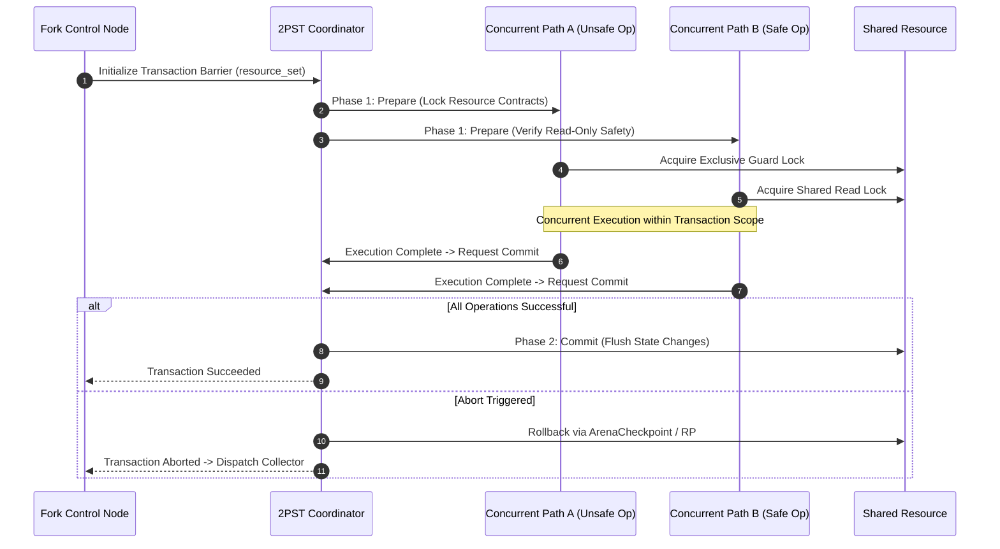

# Seam VM Intermediate Representation (IR) & Complete ABI/Spec Technical Architecture

---

## Part I: Seam Low-Level IR (LLIR) Specification

The Seam Low-Level IR bridges high-level language abstractions (`channel`, `operator`, `resource`, `control`) and physical hardware registers (`r14`/`x27`, `rbp`/`x29`, `r15`/`x28`). It operates as a Static Single Assignment (SSA) intermediate language designed for zero-overhead exception routing and deterministic arena-based memory management.

### 1. IR Instruction Set Architecture (ISA)

| Instruction | Operands | Description |
| --- | --- | --- |
| `oa.alloc` | `size: i64, align: i64` | Emits fast-path inline bump allocation against `bump_ptr` (`r14`/`x27`), trapping to slow-path on boundary violation. |
| `oa.save` | none | Captures current `bump_ptr` state into an `ArenaCheckpoint` descriptor. |
| `oa.restore` | `cp: ArenaCheckpoint` | Restores `bump_ptr` to the checkpoint snapshot address in $O(1)$ time. |
| `cop.bind` | `target: *mut u8` | Updates the active Control Operator Pointer (`rbp`/`x29`) to a new execution context. |
| `rp.capture` | none | Moves the active `COP` context into the Resource Pointer (`r15`/`x28`), converting it into an immutable Ghost Resource. |
| `jmp.direct` | `target_ip: *mut u8` | Performs an unconditional direct jump to a collector or handler without stack unwinding. |
| `tx.prepare` | `resource_set` | Establishes a 2-Phase Static Transaction barrier for `unsafe` operators across `fork` boundaries. |
| `tx.commit` | none | Finalizes transactional state mutations across verified resource contracts. |
| `tx.abort` | none | Rolls back transactional modifications and triggers the localized `collector`. |

### 2. SSA Representation of IR Control Flow

```text
bb0:
    %cp0 = oa.save
    %p1 = oa.alloc 256, 8
    call @process(%p1)
    br bb1

bb1:
    %cond = call @loop_condition()
    cond_br %cond, bb2, bb3

bb2:
    oa.restore %cp0
    br bb0

bb3:
    ret

```

---

## Part II: Enhanced OperatorArena Virtual Memory & Guard Page Management

To guarantee safety and prevent silent heap corruption during fast-path pointer increments, `OperatorArena` relies on operating system virtual memory mapping primitives (`mmap` on Unix, `VirtualAlloc` on Windows) augmented with non-accessible guard pages (`PROT_NONE`).

### 1. Virtual Memory Layout Structure

```text
+-------------------+-----------------------+-------------------+
| Low Guard Page    | Active Arena Region   | High Guard Page   |
| (4KB, PROT_NONE)  | (Dynamically Committed)| (4KB, PROT_NONE)  |
+-------------------+-----------------------+-------------------+
^                   ^                       ^                   |
|                   |                       |                   |
base_ptr - 4096     base_ptr                limit_ptr           limit_ptr + 4096

```

### 2. Guard Page Fault Interception Protocol

When an allocation request exceeds the remaining capacity of the arena, `bump_ptr` crosses `limit_ptr` and attempts to write into the High Guard Page. This triggers an OS-level segmentation fault (`SIGSEGV` on Unix, `EXCEPTION_ACCESS_VIOLATION` on Windows).

1. **Fault Detection:** The CPU catches the illegal access at $address \ge limit\_ptr$.
2. **Signal Handler Dispatch:** The Seam VM runtime registers a dedicated signal handler that inspects the faulting instruction pointer (IP) and faulting address.
3. **Resolution Action:**
* If the faulting address lies within the High Guard Page bounds, the runtime evaluates whether the arena can be lazily expanded or if a memory exhaustion exception must be raised.
* If expandable, the runtime maps additional physical memory via `mprotect` / `VirtualProtect` and shifts `limit_ptr` upward.
* If unexpandable, the runtime invokes the pre-bound `collector` via the $O(1)$ Direct Jump protocol, converting the active scope into a Ghost Resource via `RP`.


---

## Part III: Compiler Lowering Pipeline & Register Allocation

The Seam compiler transforms high-level syntax trees through several strict intermediate phases before emitting native machine code.

```text
[Seam Source Code]
        │
        ▼ (Parsing & Type Checking)
[Typed AST]
        │
        ▼ (Effect Analysis & Contract Validation)
[SSA High-Level IR]
        │
        ▼ (ABI Lowering & Register Binding)
[Low-Level IR (LLIR)]
        │
        ▼ (Machine Code Generation)
[Native Assembly (x86-64 / AArch64)]

```

### 1. Lowering a Channel with Entry, Collector, and Fork

Consider a Seam channel execution path:

```seam
channel ComputePipeline {
    entry {
        record Data { int val; }
        Data d = Data(42);
        int res = add(d.val, 10);
        return res;
    }
    collector {
        abort res;
    }
}

```

The compiler lowers this into the following x86-64 assembly sequence, binding registers according to the ABI layer specification:

```assembly
.global ComputePipeline_Entry
.type ComputePipeline_Entry, @function
ComputePipeline_Entry:
    ; 1. Save checkpoint for potential recovery
    mov     %r14, %rcx                  ; saved_bump_ptr = bump_ptr

    ; 2. Allocate record memory on OperatorArena (fast-path)
    mov     $8, %rsi                    ; size of Data record
    mov     %r14, %rax                  ; copy bump_ptr
    add     %rsi, %r14                  ; advance bump_ptr (r14)
    movabs  $limit_ptr_imm, %rdx
    cmp     (%rdx), %r14
    ja      .L_arena_exhausted

    ; 3. Store record field value
    movq    $42, (%rax)

    ; 4. Execute operator 'add' via ABI inline instruction
    mov     (%rax), %rdi                ; load left int
    mov     $10, %rsi                   ; load right int
    add     %rdi, %rsi                  ; perform add (result in %rsi)

    ; 5. Normal return path completion
    mov     %rsi, %rax                  ; return value
    ret

.L_arena_exhausted:
    ; --- O(1) Direct Jump Abort Sequence ---
    mov     %rbp, %r15                  ; r15 (RP) = current COP (rbp) -> Ghost Resource
    movabs  $Collector_Handler_IP, %rdx ; load collector entry target
    movabs  $Target_Collector_COP, %rax ; load target collector COP
    mov     %rax, %rbp                  ; rbp (COP) = target COP
    mov     %rcx, %r14                  ; restore bump_ptr to pre-allocation state
    jmp     *%rdx                       ; Direct jump to collector

```

---

## Part IV: 2PST (2-Phase Static Transaction) Formal Protocol for Unsafe Operators

When a `fork` control construct contains custom or unverified (`unsafe`) operators, static compile-time race-freedom guarantees cannot be fully verified. To maintain memory safety without rejecting parallel execution, Seam enforces the **2PST (2-Phase Static Transaction)** protocol at runtime.

### 1. Protocol Architecture



### 2. Transactional Invariants

1. **Atomicity Guarantee:** All state modifications performed by an `unsafe` operator within a `fork` branch are isolated to local arena memory until the `tx.commit` instruction successfully validates all resource contracts.
2. **Deterministic Rollback:** If any path within a `fork` control block triggers an `abort`, the transaction coordinator instantly invokes `oa.restore` on participating arenas and routes execution through the designated `collector` utilizing the `ResourcePtr` (`r15`) snapshot.