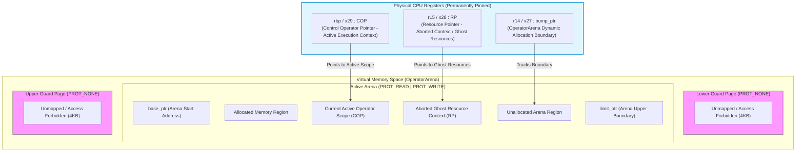
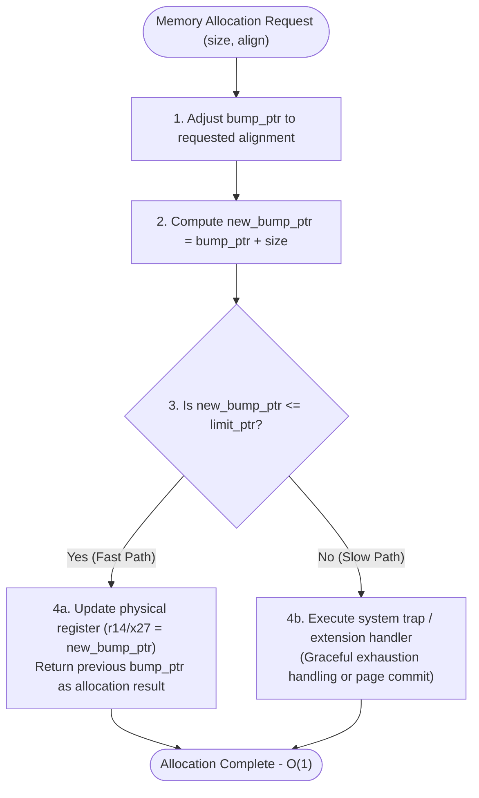

# Seam VM Comprehensive Specification

## 1. Seam VM Directory Structure and Module Design

Seam VM adopts a single monolithic crate configuration to eliminate all FFI (Foreign Function Interface) overhead and maximize extreme performance as an internally complete virtual machine ($O(1)$ allocation, direct jumps, and multi-layered defense reclamation of ghost resources). To prevent implementation divergence and code bloating among components with similar responsibilities, it establishes clear parent directories (subsystem boundaries) for code sharing. All layers—from frontend parsing to low-level intermediate representation (LLIR), physical register management, OS platform abstraction, 2PST transaction coordination, and target-specific code generation—are organically integrated within a single context.

```plaintext
seam-vm/
├── Cargo.toml                      # Workspace and single-crate root configuration
└── src/
    ├── lib.rs                      # Crate entry point and public module re-exports
    ├── frontend/                   # Frontend integration directory
    │   ├── mod.rs                  # Frontend pipeline orchestration
    │   ├── ast/                    # Abstract syntax tree definitions (primitives, records, resources, channels, operator [safe/unsafe], control)
    │   ├── parser/                 # Lexical and syntactic parser including explicit unsafe markers
    │   ├── typecheck/              # Type inference and static verification of resource contracts
    │   └── syntax/                 # Explicit unsafe operator modifiers and 2PST scope verification
    ├── ir/                         # Intermediate representation and optimization pass integration directory
    │   ├── mod.rs                  # IR pipeline orchestration
    │   ├── llir.rs                 # Deterministic LLIR instruction set definitions with transaction/arena semantics
    │   ├── ssa.rs                  # Static Single Assignment (SSA) conversion pass
    │   └── passes/                 # Optimization pass orchestration directory (arena allocation optimization and automatic GAC insertion passes)
    ├── abi/                        # Physical ABI layer and platform memory management integration directory
    │   ├── mod.rs                  # ABI layer entry point
    │   ├── layout.rs               # OperatorArena struct and alloc definition
    │   ├── checkpoint.rs           # ArenaCheckpoint struct and save/restore definitions
    │   ├── register.rs             # Type-safe wrappers for physical register bindings (r14/x27, rbp/x29, r15/x28)
    │   ├── platform/               # Platform abstraction subsystem absorbing OS differences (mmap_unix.rs, mmap_win.rs, guard page control)
    │   └── jump/                   # Assembly interface for $O(1)$ direct jump exception handling eliminating stack unwinding
    ├── runtime/                    # Execution engine, collector, and 2PST transaction coordination integration directory
    │   ├── mod.rs                  # Runtime entry point
    │   ├── executor.rs             # Execution context management and channel dispatch
    │   ├── collector.rs            # Audit of memory regions pointed to by RP (r15) and cleanup of ghost resources upon abnormal termination
    │   ├── tx.rs                   # 2PST (2-Phase Static Transaction) coordinator arbitrating execution boundaries of explicit unsafe operators
    │   └── os.rs                   # OS abstraction layer managing signal trapping (such as SIGSEGV) upon guard page overflow and trap processing
    └── codegen/                    # Native code generator (JIT / AOT) integration directory
        ├── mod.rs                  # Code generator entry point
        ├── lowering.rs             # Conversion from LLIR instructions with transaction/arena semantics to inline assembly
        └── backends/               # Target-specific backend emitter orchestration directory (x86_64.rs, aarch64.rs)
```

---

## 2. Module Boundaries and Redefinition of Responsibilities

While eliminating physical walls between components in Seam VM, each parent directory and sub-module maintains a strict single-responsibility principle to prevent design philosophy confusion. In particular, the establishment of a commonization layer to prevent implementation divergence of similar responsibilities and a multi-layered defense model for safety are clearly organized.

### 2.1 Frontend & Syntactic Verification (`frontend/`)

* **Responsibility:** Takes Seam source code as input, executing abstract syntax tree construction, type inference, and resource contract verification within a unified pipeline.
* **Key Module Boundaries:**
* `ast/`: Defines data structures for primitives, records, resources, channels, and control structures, as well as `operator` (safe / explicit unsafe) as a privileged meta-syntax for direct IR/ABI calls, clearly distinguished from regular user-written functions (such as pure channel-like functions).
* `parser/`: Accurately extracts explicit unsafe operator markers from source code and constructs the lexical/syntax tree.
* `typecheck/`: Statically detects resource contentions through channels and blocks invalid access propagation.
* `syntax/`: Statically verifies that explicit unsafe operators written in the syntax are properly enclosed within valid 2PST transaction contexts. This verification acts as a first-class defensive wall in compile-time guarantees.


### 2.2 Low-Level Intermediate Representation & SSA (`ir/`)

* **Responsibility:** Lowers the typed AST not as a hardware-agnostic abstract layer, but directly into a primary Intermediate Representation (LLIR) that explicitly expresses transaction semantics such as arena allocation, checkpoints, and direct jumps, followed by optimization.
* **Key Module Boundaries:**
* `llir.rs`: Defines the instruction set specifying the operation specifications (What) in program control flow, such as `oa.alloc`, `oa.save`, `oa.restore`, `cop.bind`, `rp.capture`, and `jmp.direct`.
* `ssa.rs`: Expresses variable lifecycles and arena checkpoint scopes in Static Single Assignment form.
* `passes/`: Aggregates and executes optimization passes such as inserting GAC (Generational Arena Checkpoint) to automate the destruction of temporary arena regions in loop structures.


### 2.3 Physical ABI Layer, Register Bindings, and Memory Management (`abi/`)

* **Responsibility:** Acts as a direct bridge between the virtual machine and the CPU architecture, guaranteeing physical invariants that directly control hardware state. To prevent code bloating caused by scattered OS differences and memory management logic, implementations are integrated and encapsulated by the `arena/` and `platform/` parent directories.
* **Key Module Boundaries:**
* `arena/`: Defines the 64-byte aligned `OperatorArena` structure, providing integrated arena capacity management, base/limit/bump pointer tracking, and save/restore processing via `ArenaCheckpoint`.
* `platform/`: Consolidates OS-specific virtual memory acquisition (such as `mmap` on Unix systems and `VirtualAlloc` on Windows) and `PROT_NONE` guard page setup under a unified common interface, completely eliminating duplicate code.
* `register.rs`: Provides type-safe transparent wrappers (`#[repr(transparent)]`) for physical register bindings: `r14/x27` (bump_ptr), `rbp/x29` (COP), and `r15/x28` (RP).
* `jump.rs`: Completes exception handling in an $O(1)$ direct jump via a mere 3-instruction inline assembly sequence, without performing stack unwinding or referencing DWARF tables.


### 2.4 Execution Engine, Collector, and Transaction Coordination (`runtime/`)

* **Responsibility:** Manages program execution control, channel dispatch, and contention arbitration via the 2PST coordinator, while providing a dynamic safety net (multi-layered defense) against anomalous conditions that slip past static verification.
* **Key Module Boundaries:**
* `collector.rs`: Safely audits the memory region pointed to by RP (`r15`) in the event of an anomalous termination, executing ghost resource reclamation and log output.
* `tx.rs`: Manages the Prepare, Commit, and Abort phases of 2PST (2-Phase Static Transaction) to safely arbitrate concurrent execution of unsafe operators under fork control.
* `os.rs`: Orchestrates trap processing to capture OS-dependent signals (such as `SIGSEGV`) occurring during guard page overflows, functioning as a process-isolation barrier.


### 2.5 Native Code Generation (`codegen/`)

* **Responsibility:** Accepts LLIR instructions with transaction and arena semantics, lowering them directly into inline assembly sequences for the target architecture without the overhead of runtime function calls. To prevent target backends from scattering, the `backends/` parent directory shares a common emitter structure.
* **Key Module Boundaries:**
* `lowering.rs`: Deterministically expands LLIR instructions into platform-specific machine code instructions.
* `backends/`: Aggregates target-specific emitters such as `x86_64.rs` and `aarch64.rs`, accurately outputting arena allocation fast paths and direct jump binaries while complying with platform conventions like System V ABI or AAPCS64.


---

## 3. System Architecture and Physical Register Map

The core of Seam VM's execution efficiency lies in permanently pinning control pointers and allocation boundaries to CPU physical registers, eliminating function call and stack operation overhead.



| Concept Name | Register (x86-64) | Register (AArch64) | Lifetime | Role and Invariant |
| --- | --- | --- | --- | --- |
| `bump_ptr` | `r14` | `x27` | Execution Scope Duration | Leading allocation boundary in the active `OperatorArena`. Always maintains $base\_ptr \le bump\_ptr \le limit\_ptr$. |
| `COP` | `rbp` | `x29` | Execution Scope Duration | Control Operator Pointer for the currently executing operator scope. Points to the active code execution context. |
| `RP` | `r15` | `x28` | From Abort to Reclamation Complete | Resource Pointer. Holds the memory address, allocation state, and system context of the frame immediately prior to an abort, making it available for post-audit by the collector. |

---

## 4. Component Detailed Functional Specifications

### 4.1 OperatorArena and High-Speed Allocation Mechanism

#### Struct Definition (C-Compatible, 64-Byte Alignment)

```rust
use std::ffi::c_void;

#[repr(C, align(64))]
pub struct OperatorArena {
    /// Start address of the allocatable arena region (page-aligned)
    pub base_ptr: *mut u8,
    /// End address of the allocatable arena region (start point of PROT_NONE guard page)
    pub limit_ptr: *mut u8,
    /// Current allocation boundary address (directly synchronized with physical register r14 / x27)
    pub bump_ptr: *mut u8,
    /// Physical memory capacity of the arena (in bytes)
    pub capacity: usize,
    /// OS virtual memory handle (Unix: mmap ptr, Windows: VirtualAlloc ptr)
    pub sys_alloc_ptr: *mut c_void,
}

impl OperatorArena {
    pub fn new(capacity: usize) -> Self {
        // Initialize the arena uniformly by absorbing OS differences via abi/platform/ subsystem
        crate::abi::platform::allocate_guarded_arena(capacity)
    }
}

```

#### Allocation Fast-Path Flow



### 4.2 ArenaCheckpoint and GAC (Generational Arena Checkpoint)

`ArenaCheckpoint` is a lightweight structure designed to instantly snapshot and rewind the allocation state of an `OperatorArena` at a specific point in time, managed centrally within the `abi/arena/` subsystem.

```rust
#[repr(C)]
#[derive(Debug, Copy, Clone, PartialEq, Eq)]
pub struct ArenaCheckpoint {
    /// saved_bump_ptr address at the time of snapshot acquisition
    pub saved_bump_ptr: *mut u8,
}

```

By executing `ArenaCheckpoint::restore` at loop back-edges, memory regions temporarily allocated within loops are bulk-disposed in $O(1)$, preventing memory leaks and arena exhaustion.

### 4.3 Direct Jump Exception Protocol ($O(1)$ Abort Sequence)

When a system error or anomalous termination occurs, stack unwinding or heavy unrolling procedures are omitted, transitioning instantly to the exception handling context via the following fixed 3-instruction (x86-64) inline assembly sequence:

```assembly
; === O(1) Direct Jump Abort Sequence (x86-64) ===
; Prerequisites:
;   %rax = Target COP (target_cop)
;   %rdx = Collector entry jump destination address (collector_entry_ip)
;   %rcx = Arena pointer to restore (saved_bump_ptr)

mov     %rbp, %r15          ; 1. Save current COP to RP (r15) -> Isolate as ghost resources
mov     %rax, %rbp          ; 2. Load target COP into %rbp (Enable collector control)
mov     %rcx, %r14          ; 3. Restore arena pointer to checkpoint prior to abort
jmp     *%rdx               ; 4. Jump directly to collector entry point

```

---

## 5. Integrated Invariants and Verification Matrix

To ensure that the Seam VM design specifications function cohesively across the entire system, the following mathematical and structural invariants are constantly guaranteed by the build process and verification suite.

### 5.1 Core Mathematical Invariants

* **Arena Physical Boundary Condition:**

$$base\_ptr \le bump\_ptr \le limit\_ptr$$


At no moment during allocation processing is normal code execution permitted while `bump_ptr` exceeds `limit_ptr` (exceeding triggers a guard page exception or branches to a trap).
* **Alignment Invariant:**

$$\forall p = \text{alloc}(size, align), \quad p \equiv 0 \pmod{align}$$


The address $p$ returned by allocation must always match the requested power-of-two alignment.
* **Ghost Resource Lifetime Condition:**

$$RP \neq \text{NULL} \implies \text{AddressRange}(RP) \subset \text{ValidArenaMemory}$$


The memory and resource regions pointed to by RP must remain invariant and protected from reuse until auditing and processing by the collector are complete and they are freed in the next cycle.

### 5.2 Verification Matrix

| Verification Item | Prerequisite Condition | Execution Operation | Expected Post-Condition | Verification Level |
| --- | --- | --- | --- | --- |
| **Fast Path Allocation** | $bump\_ptr + size \le limit\_ptr$ | `oa_alloc(size)` | `r14` is incremented by `size`, and the old `r14` is returned. | L0 (Unit) / L1 (Assembly) |
| **Arena Exhaustion Guard** | $bump\_ptr + size > limit\_ptr$ | `oa_alloc(size)` | Comparison instruction evaluates false at guard page boundary, transitioning to `slow_path` trap. | L1 (Assembly) / L2 (OS) |
| **$O(1)$ Direct Jump** | Normal execution (COP = Active) | Abnormal termination / Abort occurs | Active COP is assigned to RP, and COP is immediately overwritten with target address. | L1 (Assembly) / System |
| **GAC Loop Memory Reset** | Multiple arena allocations within a loop | `restore(loop_cp)` | `r14` is completely restored and synchronized to the value at loop entry per iteration. | L0 (Unit) / Integration |