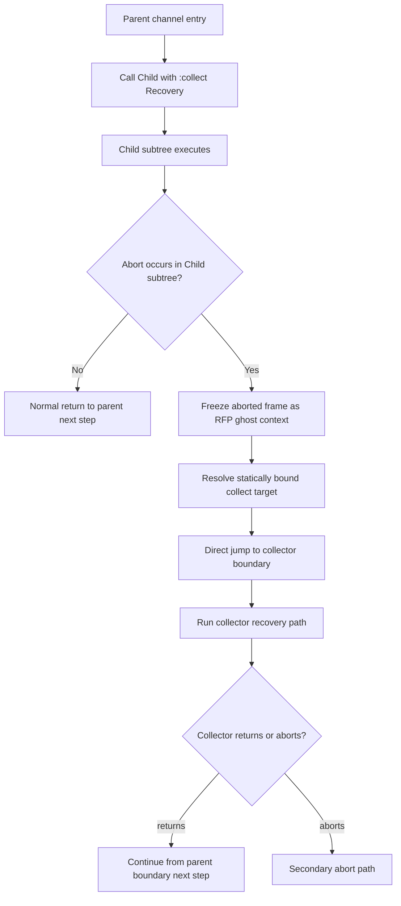
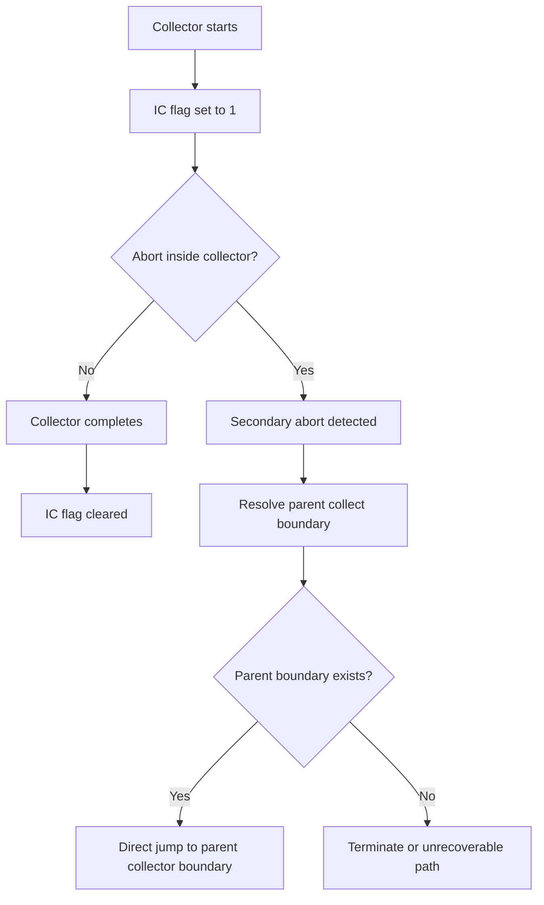
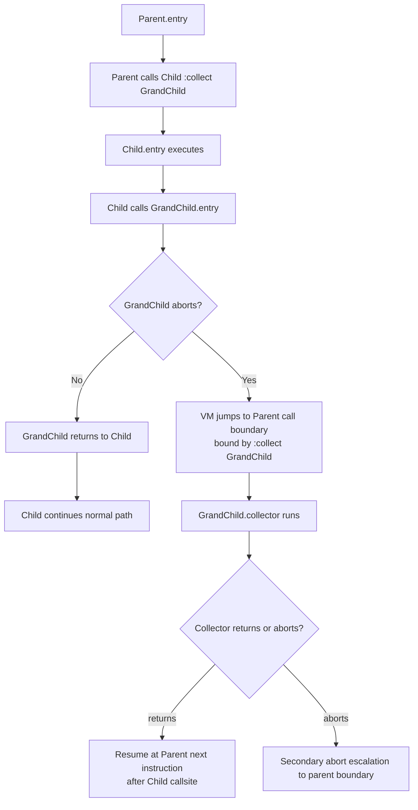

# Seam

Seam is an experimental systems programming language and runtime model that treats **execution paths** as first-class, statically verifiable entities.

Most languages type values. Seam also types control-flow paths.
By attaching contracts to path behavior, Seam aims to make execution safety, recovery behavior, and shared-resource effects predictable at compile time.

## Status

This repository currently contains:

- A language and VM draft specification: [DRAFT.md](DRAFT.md)
- A substantial runtime/bootstrap PoC: [PoC/seam-bootstrap](PoC/seam-bootstrap)
- Design notes and phase reports: [PoC/seam-bootstrap/design](PoC/seam-bootstrap/design)

Current maturity:

- Language and ABI design are still evolving (draft stage)
- Runtime PoC is implemented and testable
- Not production-ready

## Core Model (High-Level)

The following is the stable conceptual surface used across this repository.

1. **Primitive and data types**
   - Primitive types with fixed size semantics
   - Immutable `record` for structural data
   - Mutable `resource` for stateful entities

2. **Channel-based execution**
   - `channel` is the control-flow unit (similar to a function, but path-oriented)
   - `entry` is the normal execution path
   - `collector` is the recovery path

3. **Abort and collect semantics**
   - `abort` does not use traditional stack unwinding
   - Parent callsites can bind recovery with `:collect`
   - VM performs direct control transfer to the collector boundary

4. **Static effect/contracts direction**
   - `requires { read/write ... }` contracts model resource access
   - Intended for compile-time conflict analysis and safe concurrency planning

## Concepts by Example

The snippet below is intentionally small. It shows the relationship between
normal execution (`entry`), failure (`abort`), and recovery (`collector`).

```seam
channel Transfer {
  requires {
    read  { Account.balance; }
    write { Ledger.entries; }
  }

  bool entry(TransferRequest req) {
    if (req.amount <= 0) {
      abort;
    }

    // Child call with collector binding
    PersistLedger(req) :collect Transfer;
    return true;
  }

  bool collector {
    // Recovery path for this channel boundary
    // (rollback, cleanup, or fallback)
    return false;
  }
}
```

How to read this:

1. `entry` is the main path.
2. `abort` indicates that the current path cannot continue safely.
3. `:collect Transfer` pre-binds which collector should handle failure in that call subtree.
4. Recovery is explicit and part of the channel contract surface.

## Concrete Runtime Walkthrough

This is the practical flow the PoC is designed to demonstrate.

1. Channel invocation allocates frame space in PSSA via bump allocation.
2. Execution continues on the `entry` path.
3. If a failure path triggers, VM marks the aborted context as resource-frame state (RFP).
4. Instead of unwinding stack frames, VM performs direct control transfer to the collector boundary.
5. Collector executes recovery logic using deterministic frame metadata.
6. Forked paths can stage writes and then commit through 2PST order, or discard on abort.

### Abort and :collect Flow (Primary Abort)

The diagram below describes the intended call-boundary model used in this repository.
The key point is that `:collect` is a boundary binding at the parent callsite, not dynamic handler search.



### Secondary Abort Escalation

Secondary abort means abort triggered while already inside collector execution.
In this model, VM does not recurse into the same collector boundary.
It escalates to the parent collect boundary.

Important interpretation note:
This is not a try/catch-style dynamic exception model.
Collector resolution is treated as a statically bound call-boundary contract,
and secondary abort handling is modeled as escalation to the next parent boundary.



### Child-GrandChild :collect Binding Example

This example clarifies exactly where `:collect` is effective in a three-level call chain.



Binding rule in this example:

1. `:collect GrandChild` is bound at the Parent -> Child callsite.
2. The binding governs aborts from the execution subtree under that callsite.
3. If `GrandChild` aborts inside that subtree, recovery is resolved at the bound parent boundary.
4. If collector returns, execution resumes at Parent's next instruction after the bound callsite.

Implementation notes for this behavior are visible in:

- [PoC/seam-bootstrap/src/context.rs](PoC/seam-bootstrap/src/context.rs)
- [PoC/seam-bootstrap/src/direct_jump.rs](PoC/seam-bootstrap/src/direct_jump.rs)

Related implementation modules:

- [PoC/seam-bootstrap/src/pssa.rs](PoC/seam-bootstrap/src/pssa.rs)
- [PoC/seam-bootstrap/src/context.rs](PoC/seam-bootstrap/src/context.rs)
- [PoC/seam-bootstrap/src/direct_jump.rs](PoC/seam-bootstrap/src/direct_jump.rs)
- [PoC/seam-bootstrap/src/transaction.rs](PoC/seam-bootstrap/src/transaction.rs)
- [PoC/seam-bootstrap/src/shadow_arena.rs](PoC/seam-bootstrap/src/shadow_arena.rs)

## Quick Glossary

- **Path Typing**: static verification of control-flow behavior, not only value types.
- **Channel**: execution unit with `entry` and optional recovery via `collector`.
- **Collector**: recovery path bound to a call boundary.
- **PSSA**: thread-local arena used as path-bounded execution memory.
- **CFP/RFP**: split pointers for control context and aborted-resource context.
- **Direct Jump Abort**: O(1)-style transfer to collector boundary, avoiding stack unwinding.
- **2PST**: speculative writes first, deterministic commit later.

## Architecture Direction

Seam design and PoC implementation focus on the following VM-level ideas:

- **PSSA** (Path-bounded Shadow Stack Arena): thread-local arena for path-bounded execution memory
- **CFP/RFP split context**: separate control/resource frame pointers for deterministic abort recovery
- **SARM** (Static Abort Register Map): static metadata for register restoration and jump targets
- **Direct Jump abort path**: O(1) abort-to-collector transfer
- **GAC** (Generational Arena Checkpoint): loop memory checkpoint/rollback behavior
- **2PST** (Two-Phase Static Transaction): speculative-to-commit model for concurrent resource writes

For formal details and rationale, see [DRAFT.md](DRAFT.md).

## PoC Implementation Summary

The PoC lives in [PoC/seam-bootstrap](PoC/seam-bootstrap) and currently provides:

- Core runtime modules for arena/context/abort handling
- Resource/effect/contract model scaffolding
- Compiler-side structures (AST, analysis, pseudo-code generation)
- Runtime linker + fork executor path
- Signal and debugger integration modules
- Architecture bindings for x86-64 and AArch64

Observed from current test run:

- `cargo test --release --lib` passes with **162/162 tests**

Main module surface is exported from [PoC/seam-bootstrap/src/lib.rs](PoC/seam-bootstrap/src/lib.rs).

## Getting Started

### Prerequisites

- Rust 1.70+ (Edition 2021)
- Windows, Linux, or macOS
- x86-64 (primary), AArch64 (secondary path in source)

### Build the PoC

```bash
cd PoC/seam-bootstrap
cargo build --release
```

### Run tests

```bash
cd PoC/seam-bootstrap
cargo test --release --lib
```

### Run demo binary

```bash
cd PoC/seam-bootstrap
cargo run --release --bin seam-vm
```

## Repository Map

- [DRAFT.md](DRAFT.md)
  - Full language/VM RFC draft
  - Includes conceptual model, ABI-level direction, and exploratory sections
- [PoC/seam-bootstrap/README.md](PoC/seam-bootstrap/README.md)
  - Detailed phase-by-phase PoC description
- [PoC/seam-bootstrap/REPORT.md](PoC/seam-bootstrap/REPORT.md)
  - Test coverage and requirement mapping report
- [PoC/seam-bootstrap/design](PoC/seam-bootstrap/design)
  - Focused design writeups (PSSA modernization, direct jump integration, signal integration, debugger integration, etc.)

## Design Notes Index

- [PoC/seam-bootstrap/design/PSSA_MODERNIZATION.md](PoC/seam-bootstrap/design/PSSA_MODERNIZATION.md)
- [PoC/seam-bootstrap/design/BARRIER_INSERTION.md](PoC/seam-bootstrap/design/BARRIER_INSERTION.md)
- [PoC/seam-bootstrap/design/RUNTIME_LINKING.md](PoC/seam-bootstrap/design/RUNTIME_LINKING.md)
- [PoC/seam-bootstrap/design/FORK_EXECUTOR.md](PoC/seam-bootstrap/design/FORK_EXECUTOR.md)
- [PoC/seam-bootstrap/design/PSEUDO_CODE_INTERPRETER.md](PoC/seam-bootstrap/design/PSEUDO_CODE_INTERPRETER.md)
- [PoC/seam-bootstrap/design/DIRECT_JUMP_INTEGRATION.md](PoC/seam-bootstrap/design/DIRECT_JUMP_INTEGRATION.md)
- [PoC/seam-bootstrap/design/SIGNAL_INTEGRATION.md](PoC/seam-bootstrap/design/SIGNAL_INTEGRATION.md)
- [PoC/seam-bootstrap/design/DEBUGGER_INTEGRATION.md](PoC/seam-bootstrap/design/DEBUGGER_INTEGRATION.md)

## Scope and Non-Goals (Current)

Current repository does **not** yet present a complete, production language toolchain.
At this stage, this project should be read as:

- A strong VM/runtime architecture prototype
- A language semantics draft under active design
- A research-grade implementation path toward Seam 1.0-alpha

## Roadmap (Pragmatic)

1. Stabilize language grammar/type rules around path typing and contracts
2. Tighten compiler-to-runtime ABI contract generation
3. Expand concurrency validation and failure mode proofs
4. Integrate end-to-end source pipeline (language input to executable runtime form)
5. Harden platform behavior and diagnostics for production-like workloads

## License

This project is licensed under the MIT License.

- [LICENSE](LICENSE)
